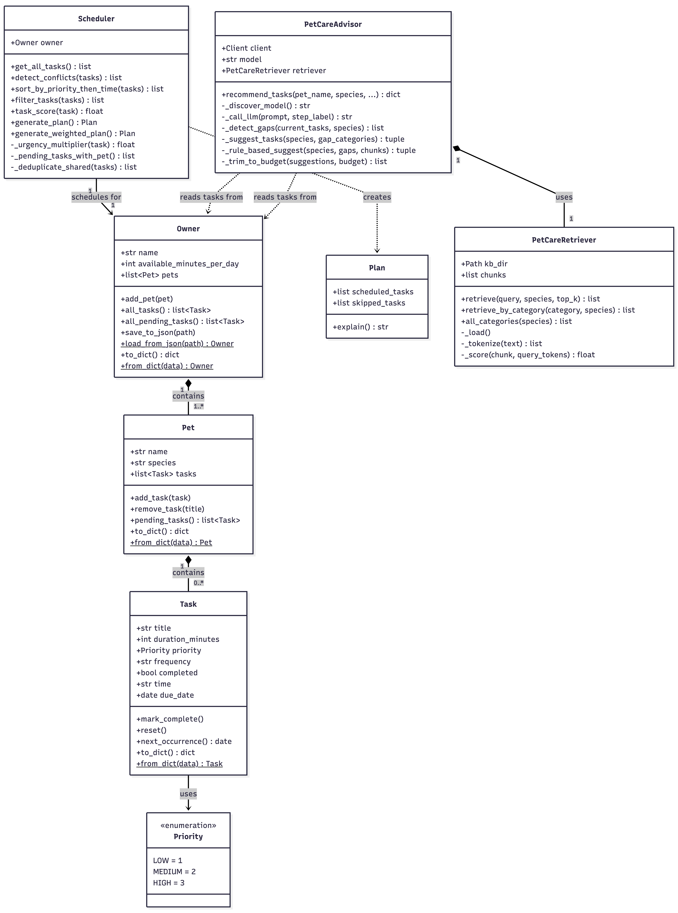
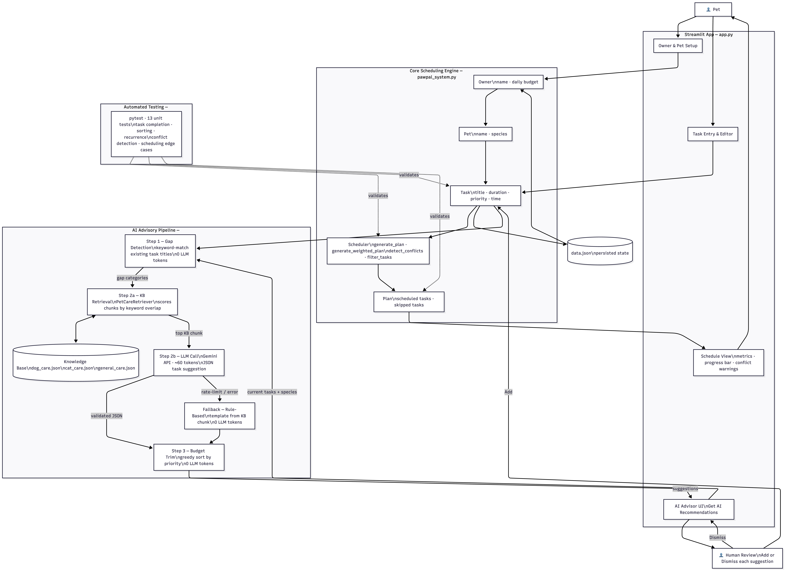
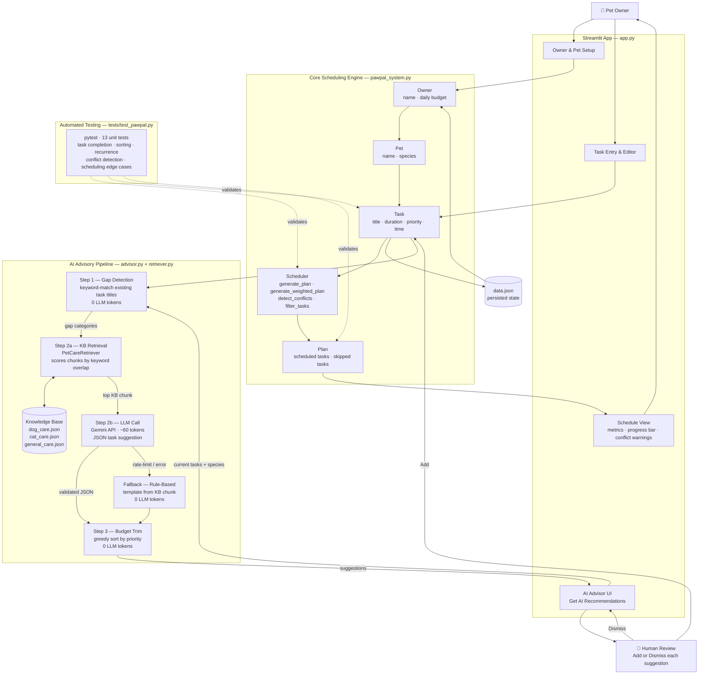

# PawPal+ — AI-Powered Pet Care Planning Assistant

> A Streamlit application that helps busy pet owners build consistent daily care routines, with an AI advisor that detects gaps in a pet's schedule and recommends evidence-based tasks.

---

## Demo

▶️ **[Watch the full walkthrough on Loom](https://www.loom.com/share/9857fafc3e694d5ba737ef1c16aef6e7)**

The video demonstrates end-to-end system behaviour.

---

## Table of Contents

1. [Demo](#demo)
2. [Original Project](#original-project)
3. [Title and Summary](#title-and-summary)
4. [Architecture Overview](#architecture-overview)
5. [Setup Instructions](#setup-instructions)
6. [Sample Interactions](#sample-interactions)
7. [Design Decisions](#design-decisions)
8. [Model Card](#model-card)

---

## Original Project

**PawPal** (the base project) is a Python scheduling assistant for pet owners. Its original goals were to:

- Let owners register multiple pets and add care tasks with priorities, durations, and preferred start times
- Run a greedy scheduling algorithm that fills a daily time budget with the highest-priority tasks first, detecting and surfacing any time conflicts
- Persist all data to `data.json` so nothing is lost between sessions

The original system covered the full scheduling lifecycle — task entry, conflict detection, priority/urgency-weighted ranking, recurring task generation, and a Streamlit UI — but provided no guidance on *what* tasks to add in the first place.

---

## Title and Summary

**PawPal+** extends the original scheduler with an AI advisory layer that answers the question the original app couldn't: *"What am I forgetting?"*

The AI advisor analyses an owner's current task list, identifies which pet-care categories (exercise, feeding, grooming, health, enrichment, hygiene) are missing, retrieves relevant guidance from a local knowledge base, and uses Google Gemini to generate a specific, actionable task suggestion — all within the owner's remaining daily time budget. If the AI API is unavailable or rate-limited, the system falls back to a rule-based suggestion generated directly from the knowledge base, so the feature always delivers a result.

**Why it matters:** New pet owners frequently don't know which care routines matter most, and even experienced owners let categories slip when life gets busy. PawPal+ turns a blank task list into a guided starting point grounded in best practices.

---

## Architecture Overview

The system has three layers: a Streamlit UI (`app.py`), a core scheduling engine (`pawpal_system.py`), and an AI advisory pipeline (`advisor.py` + `retriever.py`).

### Component View

The first diagram shows the main classes, their responsibilities, and how they are composed:



| Component | File | Role |
|---|---|---|
| `Priority` | `pawpal_system.py` | Enum (`LOW / MEDIUM / HIGH`) used for type-safe sorting |
| `Task` | `pawpal_system.py` | Dataclass — single care activity with duration, priority, time, recurrence |
| `Pet` | `pawpal_system.py` | Dataclass — owns a list of `Task` objects |
| `Owner` | `pawpal_system.py` | Dataclass — owns a list of `Pet` objects; handles JSON serialisation |
| `Scheduler` | `pawpal_system.py` | Scheduling algorithms (greedy, weighted), conflict detection, filtering |
| `Plan` | `pawpal_system.py` | Output of `Scheduler` — scheduled tasks + skipped tasks |
| `PetCareRetriever` | `retriever.py` | Loads local KB chunks, scores them by keyword overlap, returns top matches |
| `PetCareAdvisor` | `advisor.py` | Orchestrates the 3-step agentic workflow; wraps `PetCareRetriever` + Gemini |

### Data Flow View

The second diagram shows how data moves through the system end-to-end, including where the human makes decisions and where tests validate behaviour:





**How the AI pipeline works step by step:**

1. **Gap Detection (0 LLM tokens):** The advisor keyword-matches existing task titles against category dictionaries (`{"exercise": {"walk","run","fetch",...}, "grooming": {"brush","bath","nail",...}, ...}`). Categories with no matching task are flagged as gaps. This step costs nothing — no API call.

2. **Retrieval + LLM Suggestion (~60 tokens):** The `PetCareRetriever` scores all local knowledge-base chunks using weighted keyword overlap and returns the best match. A minimal prompt (`"Suggest one exercise task for a dog. Fact: <KB snippet>. JSON only: {...}"`) is sent to Gemini. The response is validated and sanitised before use.

3. **Budget Trim (0 LLM tokens):** The suggestion is checked against the owner's remaining daily time. If it doesn't fit, the advisor drops it rather than over-scheduling. This is a code-only step.

4. **Fallback:** If the Gemini call fails for any reason (rate limit, network error), the advisor generates a task directly from the KB chunk using a pre-defined template per category — no API call, instant result.

---

## Setup Instructions

### Prerequisites

- Python 3.10 or later
- A free Google Gemini API key from [aistudio.google.com](https://aistudio.google.com) (no billing required)

### 1. Clone the repository

```bash
git clone <repo-url>
cd ai110-final-project-pawpal
```

### 2. Create and activate a virtual environment

```bash
python -m venv .venv
source .venv/bin/activate        # Windows: .venv\Scripts\activate
```

### 3. Install dependencies

```bash
pip install -r requirements.txt
```

### 4. Add your API key

```bash
cp .env.example .env
# Open .env and replace "your-api-key-here" with your actual Gemini API key
```

Your `.env` file should look like:
```
GOOGLE_API_KEY=AIza...your-key-here
```

> **Note:** The `.env` file is in `.gitignore` and will never be committed. Your key stays local.

### 5. Run the Streamlit app

```bash
streamlit run app.py
```

The app opens at `http://localhost:8501`.

### 6. (Optional) Run the terminal demo

```bash
python main.py
```

### 7. (Optional) Run the test suite

```bash
python -m pytest tests/test_pawpal.py -v
```

---

## Sample Interactions

### Example 1 — New dog owner with no tasks

**Setup:** Owner "Alex", 120 minutes/day. Pet: "Buddy" (dog). No tasks added yet.

**Action:** Click **Get AI recommendations**.

**System behaviour:**
- Step 1 (gap detection): All 5 dog categories flagged as missing — `exercise`, `feeding`, `grooming`, `health`, `enrichment`.
- Step 2 (retrieval): Best KB chunk for "exercise dog" retrieved from `dog_care.json`.
- Step 2 (LLM): Gemini generates a structured task.
- Step 3 (budget trim): 30 minutes fits within 120-minute budget. ✓

**AI output (success path):**
```
Title:             Morning Walk
Duration:          30 minutes
Priority:          HIGH
Frequency:         daily
Suggested time:    08:00
Reason:            Dogs need at least 30 minutes of aerobic exercise daily to
                   maintain a healthy weight and reduce anxiety behaviours.
```

**AI output (fallback path — if Gemini is rate-limited):**
```
Title:             Exercise session
Duration:          30 minutes
Priority:          HIGH
Frequency:         daily
Suggested time:    08:00
Reason:            Dogs benefit greatly from daily aerobic activity to maintain
                   healthy weight and mental stimulation.

ℹ️  Suggestions based on best-practice care knowledge (AI was busy).
```

---

### Example 2 — Cat owner with feeding already scheduled

**Setup:** Owner "Maya", 90 minutes/day. Pet: "Luna" (cat). One task: "Feed Luna" (15 min, daily).

**Action:** Click **Get AI recommendations**.

**System behaviour:**
- Step 1 (gap detection): `feeding` is covered. Missing: `play`, `grooming`, `litter`, `health`.
- Top gap: `play`.
- Retriever fetches best chunk from `cat_care.json` for "play cat".
- LLM generates a play/enrichment task.

**AI output:**
```
Title:             Interactive Play Session
Duration:          20 minutes
Priority:          MEDIUM
Frequency:         daily
Suggested time:    17:00
Reason:            Cats need daily interactive play to satisfy hunting instincts
                   and prevent boredom-related behaviour problems.
```

**What the owner sees in the UI:** A card with the suggestion, a green "Add to Luna's schedule" button, and the KB source chunk shown for transparency.

---

### Example 3 — Pet with a complete schedule

**Setup:** Owner "Sam", 180 minutes/day. Pet: "Max" (dog). Tasks: morning walk, feeding, grooming brush, flea medication, training session.

**Action:** Click **Get AI recommendations**.

**System behaviour:**
- Step 1 (gap detection): All categories covered — `exercise` (walk), `feeding`, `grooming` (brush), `health` (flea medication), `enrichment` (training).
- No gap categories found. Advisor returns early — no LLM call made.

**AI output:**
```
✅ Great job! Max's schedule already covers all care categories.
```

---

## Design Decisions

### Why greedy scheduling instead of optimal (0/1 knapsack)?

The greedy algorithm always prioritises the most critical tasks first. A `HIGH`-priority medication should never be dropped to squeeze in two `LOW`-priority enrichment sessions. Greedy gives *predictable, trustworthy* output — owners know exactly why tasks were skipped. Knapsack might pack more minutes into the day but would sacrifice the highest-priority task whenever it didn't fit neatly, which is the wrong trade-off in pet care.

### Why RAG instead of pure LLM generation?

Asking an LLM to generate care advice from scratch risks hallucination — it might suggest an inappropriate exercise duration for a senior dog, or a grooming frequency that doesn't match the breed. Grounding suggestions in a curated knowledge base means the AI can only recommend what we've verified is correct. RAG also dramatically reduces token usage because only a small snippet needs to be sent to the model, not a full system prompt.

### Why a local keyword retriever instead of an embedding API?

Using an embedding model (e.g. `text-embedding-3-small`) would require another API call on every request and add a second external dependency. The knowledge base is small (13 chunks across 3 files), so a weighted keyword-overlap scorer is fast, free, and entirely predictable. It scores title matches at 1.5×, keyword matches at 2.0×, and body text at 1.0×, which is accurate enough for structured domain knowledge.

### Why a rule-based fallback?

Google Gemini's free tier has strict per-minute rate limits. Early testing showed the LLM call failing frequently enough to make the feature unreliable. Rather than showing an error message, the advisor falls back to generating a task from the KB chunk directly using pre-defined templates. The fallback produces a usable, KB-grounded suggestion in milliseconds and is clearly labelled in the UI so the owner knows what happened. Resilience matters more than perfect AI output.

### Why cache the `PetCareAdvisor` in session state?

Instantiating `PetCareAdvisor` calls `models.list()` to auto-discover which Gemini models are available on the API key. That is an extra network request on every button click. Caching the advisor in `st.session_state` means the discovery call happens once per session, reducing both latency and quota consumption.

### Why Python dataclasses for `Task`, `Pet`, and `Owner`?

Dataclasses give typed fields, `__repr__`, and equality for free. They also make the `to_dict()` / `from_dict()` serialisation pattern clean and explicit — each field is named and typed, so the round-trip to JSON is easy to reason about and test.

---

## Model Card

For full details on reliability, evaluation results, system biases, ethical considerations, AI collaboration, and reflection, see **[model_card.md](model_card.md)**.

**Quick summary:** 29 / 29 tests pass. Confidence scores averaged 1.0 for LLM suggestions and 0.80 for rule-based fallback suggestions. Testing caught a silent bug where valid LLM responses were discarded due to a JSON parsing edge case — the feature appeared to work correctly while the LLM was never actually being called.
