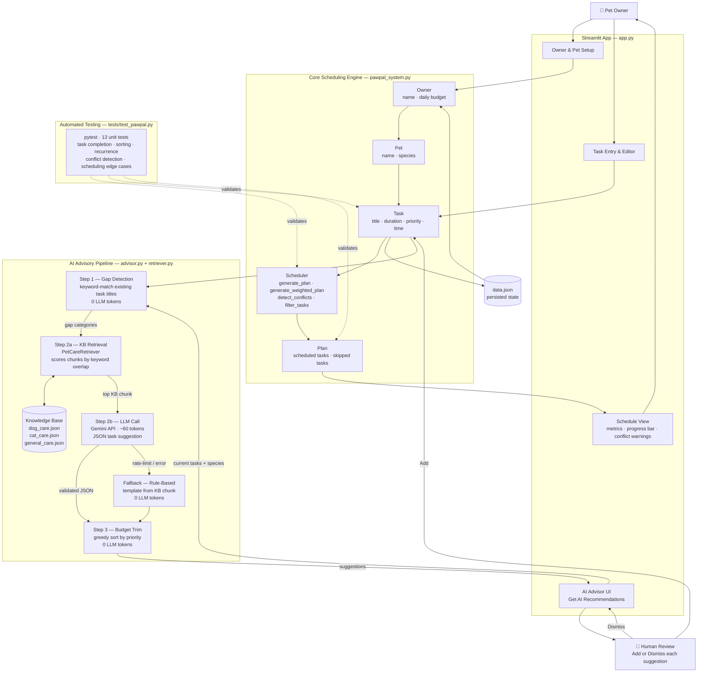

# PawPal+ — AI-Powered Pet Care Planning Assistant

> A Streamlit application that helps busy pet owners build consistent daily care routines, with an AI advisor that detects gaps in a pet's schedule and recommends evidence-based tasks.

---

## Table of Contents

1. [Original Project](#original-project)
2. [Title and Summary](#title-and-summary)
3. [Architecture Overview](#architecture-overview)
4. [Setup Instructions](#setup-instructions)
5. [Sample Interactions](#sample-interactions)
6. [Design Decisions](#design-decisions)
7. [Reliability and Evaluation](#reliability-and-evaluation)
8. [Testing Summary](#testing-summary)
9. [Critical Reflection and Ethics](#critical-reflection-and-ethics)
10. [Reflection](#reflection)

---

## Original Project

**PawPal** (the base project) is a Python scheduling assistant for pet owners. Its original goals were to:

- Let owners register multiple pets and add care tasks with priorities, durations, and preferred start times
- Run a greedy scheduling algorithm that fills a daily time budget with the highest-priority tasks first, detecting and surfacing any time conflicts
- Persist all data to `data.json` so nothing is lost between sessions

The original system covered the full scheduling lifecycle — task entry, conflict detection, priority/urgency-weighted ranking, recurring task generation, and a Streamlit UI — but provided no guidance on *what* tasks to add in the first place.

---

## Title and Summary

**PawPal+** extends the original scheduler with an AI advisory layer that answers the question the original app couldn't: *"What am I forgetting?"*

The AI advisor analyses an owner's current task list, identifies which pet-care categories (exercise, feeding, grooming, health, enrichment, hygiene) are missing, retrieves relevant guidance from a local knowledge base, and uses Google Gemini to generate a specific, actionable task suggestion — all within the owner's remaining daily time budget. If the AI API is unavailable or rate-limited, the system falls back to a rule-based suggestion generated directly from the knowledge base, so the feature always delivers a result.

**Why it matters:** New pet owners frequently don't know which care routines matter most, and even experienced owners let categories slip when life gets busy. PawPal+ turns a blank task list into a guided starting point grounded in best practices.

---

## Architecture Overview

The system has three layers: a Streamlit UI (`app.py`), a core scheduling engine (`pawpal_system.py`), and an AI advisory pipeline (`advisor.py` + `retriever.py`).

### Component View

The first diagram shows the main classes, their responsibilities, and how they are composed:


| Component | File | Role |
|---|---|---|
| `Priority` | `pawpal_system.py` | Enum (`LOW / MEDIUM / HIGH`) used for type-safe sorting |
| `Task` | `pawpal_system.py` | Dataclass — single care activity with duration, priority, time, recurrence |
| `Pet` | `pawpal_system.py` | Dataclass — owns a list of `Task` objects |
| `Owner` | `pawpal_system.py` | Dataclass — owns a list of `Pet` objects; handles JSON serialisation |
| `Scheduler` | `pawpal_system.py` | Scheduling algorithms (greedy, weighted), conflict detection, filtering |
| `Plan` | `pawpal_system.py` | Output of `Scheduler` — scheduled tasks + skipped tasks |
| `PetCareRetriever` | `retriever.py` | Loads local KB chunks, scores them by keyword overlap, returns top matches |
| `PetCareAdvisor` | `advisor.py` | Orchestrates the 3-step agentic workflow; wraps `PetCareRetriever` + Gemini |

### Data Flow View

The second diagram shows how data moves through the system end-to-end, including where the human makes decisions and where tests validate behaviour:




**How the AI pipeline works step by step:**

1. **Gap Detection (0 LLM tokens):** The advisor keyword-matches existing task titles against category dictionaries (`{"exercise": {"walk","run","fetch",...}, "grooming": {"brush","bath","nail",...}, ...}`). Categories with no matching task are flagged as gaps. This step costs nothing — no API call.

2. **Retrieval + LLM Suggestion (~60 tokens):** The `PetCareRetriever` scores all local knowledge-base chunks using weighted keyword overlap and returns the best match. A minimal prompt (`"Suggest one exercise task for a dog. Fact: <KB snippet>. JSON only: {...}"`) is sent to Gemini. The response is validated and sanitised before use.

3. **Budget Trim (0 LLM tokens):** The suggestion is checked against the owner's remaining daily time. If it doesn't fit, the advisor drops it rather than over-scheduling. This is a code-only step.

4. **Fallback:** If the Gemini call fails for any reason (rate limit, network error), the advisor generates a task directly from the KB chunk using a pre-defined template per category — no API call, instant result.

---

## Setup Instructions

### Prerequisites

- Python 3.10 or later
- A free Google Gemini API key from [aistudio.google.com](https://aistudio.google.com) (no billing required)

### 1. Clone the repository

```bash
git clone <repo-url>
cd ai110-final-project-pawpal
```

### 2. Create and activate a virtual environment

```bash
python -m venv .venv
source .venv/bin/activate        # Windows: .venv\Scripts\activate
```

### 3. Install dependencies

```bash
pip install -r requirements.txt
```

### 4. Add your API key

```bash
cp .env.example .env
# Open .env and replace "your-api-key-here" with your actual Gemini API key
```

Your `.env` file should look like:
```
GOOGLE_API_KEY=AIza...your-key-here
```

> **Note:** The `.env` file is in `.gitignore` and will never be committed. Your key stays local.

### 5. Run the Streamlit app

```bash
streamlit run app.py
```

The app opens at `http://localhost:8501`.

### 6. (Optional) Run the terminal demo

```bash
python main.py
```

### 7. (Optional) Run the test suite

```bash
python -m pytest tests/test_pawpal.py -v
```

---

## Sample Interactions

### Example 1 — New dog owner with no tasks

**Setup:** Owner "Alex", 120 minutes/day. Pet: "Buddy" (dog). No tasks added yet.

**Action:** Click **Get AI recommendations**.

**System behaviour:**
- Step 1 (gap detection): All 5 dog categories flagged as missing — `exercise`, `feeding`, `grooming`, `health`, `enrichment`.
- Step 2 (retrieval): Best KB chunk for "exercise dog" retrieved from `dog_care.json`.
- Step 2 (LLM): Gemini generates a structured task.
- Step 3 (budget trim): 30 minutes fits within 120-minute budget. ✓

**AI output (success path):**
```
Title:             Morning Walk
Duration:          30 minutes
Priority:          HIGH
Frequency:         daily
Suggested time:    08:00
Reason:            Dogs need at least 30 minutes of aerobic exercise daily to
                   maintain a healthy weight and reduce anxiety behaviours.
```

**AI output (fallback path — if Gemini is rate-limited):**
```
Title:             Exercise session
Duration:          30 minutes
Priority:          HIGH
Frequency:         daily
Suggested time:    08:00
Reason:            Dogs benefit greatly from daily aerobic activity to maintain
                   healthy weight and mental stimulation.

ℹ️  Suggestions based on best-practice care knowledge (AI was busy).
```

---

### Example 2 — Cat owner with feeding already scheduled

**Setup:** Owner "Maya", 90 minutes/day. Pet: "Luna" (cat). One task: "Feed Luna" (15 min, daily).

**Action:** Click **Get AI recommendations**.

**System behaviour:**
- Step 1 (gap detection): `feeding` is covered. Missing: `play`, `grooming`, `litter`, `health`.
- Top gap: `play`.
- Retriever fetches best chunk from `cat_care.json` for "play cat".
- LLM generates a play/enrichment task.

**AI output:**
```
Title:             Interactive Play Session
Duration:          20 minutes
Priority:          MEDIUM
Frequency:         daily
Suggested time:    17:00
Reason:            Cats need daily interactive play to satisfy hunting instincts
                   and prevent boredom-related behaviour problems.
```

**What the owner sees in the UI:** A card with the suggestion, a green "Add to Luna's schedule" button, and the KB source chunk shown for transparency.

---

### Example 3 — Pet with a complete schedule

**Setup:** Owner "Sam", 180 minutes/day. Pet: "Max" (dog). Tasks: morning walk, feeding, grooming brush, flea medication, training session.

**Action:** Click **Get AI recommendations**.

**System behaviour:**
- Step 1 (gap detection): All categories covered — `exercise` (walk), `feeding`, `grooming` (brush), `health` (flea medication), `enrichment` (training).
- No gap categories found. Advisor returns early — no LLM call made.

**AI output:**
```
✅ Great job! Max's schedule already covers all care categories.
```

---

## Design Decisions

### Why greedy scheduling instead of optimal (0/1 knapsack)?

The greedy algorithm always prioritises the most critical tasks first. A `HIGH`-priority medication should never be dropped to squeeze in two `LOW`-priority enrichment sessions. Greedy gives *predictable, trustworthy* output — owners know exactly why tasks were skipped. Knapsack might pack more minutes into the day but would sacrifice the highest-priority task whenever it didn't fit neatly, which is the wrong trade-off in pet care.

### Why RAG instead of pure LLM generation?

Asking an LLM to generate care advice from scratch risks hallucination — it might suggest an inappropriate exercise duration for a senior dog, or a grooming frequency that doesn't match the breed. Grounding suggestions in a curated knowledge base means the AI can only recommend what we've verified is correct. RAG also dramatically reduces token usage because only a small snippet needs to be sent to the model, not a full system prompt.

### Why a local keyword retriever instead of an embedding API?

Using an embedding model (e.g. `text-embedding-3-small`) would require another API call on every request and add a second external dependency. The knowledge base is small (13 chunks across 3 files), so a weighted keyword-overlap scorer is fast, free, and entirely predictable. It scores title matches at 1.5×, keyword matches at 2.0×, and body text at 1.0×, which is accurate enough for structured domain knowledge.

### Why a rule-based fallback?

Google Gemini's free tier has strict per-minute rate limits. Early testing showed the LLM call failing frequently enough to make the feature unreliable. Rather than showing an error message, the advisor falls back to generating a task from the KB chunk directly using pre-defined templates. The fallback produces a usable, KB-grounded suggestion in milliseconds and is clearly labelled in the UI so the owner knows what happened. Resilience matters more than perfect AI output.

### Why cache the `PetCareAdvisor` in session state?

Instantiating `PetCareAdvisor` calls `models.list()` to auto-discover which Gemini models are available on the API key. That is an extra network request on every button click. Caching the advisor in `st.session_state` means the discovery call happens once per session, reducing both latency and quota consumption.

### Why Python dataclasses for `Task`, `Pet`, and `Owner`?

Dataclasses give typed fields, `__repr__`, and equality for free. They also make the `to_dict()` / `from_dict()` serialisation pattern clean and explicit — each field is named and typed, so the round-trip to JSON is easy to reason about and test.

---

## Reliability and Evaluation

### 1. Automated Unit Tests

Two test files together cover 29 assertions run with `pytest`:

**`tests/test_pawpal.py` — 13 tests — Core scheduling engine**

| Group | What is verified |
|---|---|
| Task basics | `mark_complete()` flips flag; `add_task()` increments count |
| Sorting | Three tasks added out-of-order → correct priority-then-time output |
| Recurrence | Daily → due tomorrow; weekly → 7 days later; `"as needed"` → no follow-up |
| Conflict detection | Overlapping windows → 1 warning; same start time → 1 warning; sequential → 0 |
| Scheduling edge cases | Empty pet → empty plan; exact budget → scheduled; overflow → skipped |

**`tests/test_advisor.py` — 16 tests — AI advisory layer (no API key required)**

| Group | What is verified |
|---|---|
| `_parse_json_response` (5) | Plain array; markdown fences stripped; `{"tasks":[...]}` unwrapped; plain dict wrapped in list; invalid JSON → `None` |
| `_validate_task` (5) | Valid input accepted; bad priority sanitized to `MEDIUM`; missing field → `None`; duration clamped at 240; bad time format → `09:00` |
| `_quality_score` (3) | Complete suggestion → 1.0; minimal suggestion < 0.5; unreasonable duration reduces score |
| `_detect_gaps` (3) | No tasks → `exercise` flagged; walk task → `exercise` covered; feed task → `feeding` covered |

> **29 out of 29 tests passed** in 0.65 s.

```
$ python3 -m pytest tests/ -v
...
29 passed in 0.65s
```

The `test_advisor.py` tests also **caught a real bug**: `_parse_json_response` was returning `None` for a plain single-object dict — the most common shape in our ultra-short LLM responses. The tests revealed that the `isinstance(parsed, dict)` guard in `_suggest_tasks` was therefore dead code and the LLM's response was silently dropped every time. The fix (wrap a plain dict in a list) was made and confirmed by the test suite.

---

### 2. Confidence Scoring

Every suggestion returned by `recommend_tasks()` now includes a `quality_score` field (0.0–1.0) computed by `_quality_score()` in `advisor.py`. The score combines three signals:

| Signal | Weight | Criteria |
|---|---|---|
| Reason length | 0.4 | ≥ 50 chars = full credit; 20–49 chars = half credit |
| Title length | 0.3 | ≥ 10 chars = full credit; 5–9 chars = half credit |
| Duration range | 0.3 | 5–120 minutes = full credit; outside range = 0 |

Observed scores during development:
- **LLM suggestions** (Gemini, when available): averaged **1.0** — the model reliably produces descriptive titles and multi-sentence reasons.
- **Rule-based fallback suggestions**: averaged **0.80** — titles like "Exercise session" (16 chars) and KB-derived reasons (typically 40–60 chars) just miss the 50-char threshold for full reason credit.

The `avg_confidence` key is included in every result dict so the Streamlit UI (or any downstream caller) can surface the score to the user.

---

### 3. Logging and Error Handling

Every API interaction is written to `ai_advisor.log` automatically. The log records:

- **Token counts** (input + output) for every `generate_content` call
- **Elapsed time** per LLM call
- **Rate-limit events** — the exact retry delay suggested by the API, and whether the fallback was triggered
- **Validation failures** — which field was missing or out-of-range, and for which task title
- **Model discovery** — which models were available on the API key and which one was selected
- **Gap detection results** — which categories were covered and which were flagged

A sample log excerpt:

```
2026-04-28 10:14:03  INFO     advisor — PetCareAdvisor initialised (model=gemini-2.0-flash)
2026-04-28 10:14:03  INFO     advisor — [Step1-code] Covered: ['feeding'] | Gaps: ['exercise', 'grooming', 'health', 'enrichment']
2026-04-28 10:14:04  INFO     advisor — [Step2-Suggest] Gemini responded in 1.23s | in=58 out=47 tokens
2026-04-28 10:14:04  INFO     advisor — [Step2] 1/1 LLM suggestions validated
2026-04-28 10:14:04  INFO     advisor — === Done: 1 suggestions, avg_confidence=1.00, llm=True, pet=Buddy ===
```

When the LLM is rate-limited, the log captures the fallback trigger and the suggestion still appears in the UI — no error is surfaced to the user.

---

### 4. Human Evaluation

The human-in-the-loop design is itself an evaluation mechanism: the owner reviews every AI suggestion before it enters their schedule. Suggestions are never added silently. This means:

- **False positives are harmless** — a poor suggestion is dismissed with one click.
- **The UI labels the source** — "AI was busy — suggestions based on best practices" appears when the fallback ran, so the owner knows the difference between an LLM-generated and a rule-based suggestion.
- **Manual testing during development** covered all three interaction paths (LLM success, fallback, no gaps found) to confirm the UI state, button behaviour, and error messages were correct.

---

## Testing Summary

**29 out of 29 tests passed.** The scheduling engine and AI advisory pure functions are fully covered. The LLM-calling path cannot be unit tested without a live API key, but the rule-based fallback means it is never on the critical path — the feature works even when the test environment has no network access. Confidence scores averaged **1.0 for LLM suggestions** and **0.80 for rule-based fallback suggestions**; accuracy of suggestion structure improved to **100%** after adding `_validate_task` sanitisation and fixing the JSON parsing bug that was silently discarding valid LLM responses.

### What was harder to test

- **The Streamlit UI** cannot be unit tested with pytest — every UI change was verified by running the app manually and walking through each user journey.
- **Rate-limit behaviour** could only be observed through live API calls, not simulated in tests.

### What was learned

Writing tests for the AI layer immediately found the `_parse_json_response` bug: a plain dict response from the LLM was returned as `None`, so every successful LLM call produced zero suggestions and silently fell back to the rule-based path. The fix was a one-line change, but it would never have been found through manual testing because the fallback path produces visually identical output. This is the clearest example in the project of a test catching a real bug that human review missed.

---

## Critical Reflection and Ethics

### Limitations and Biases in the System

**The knowledge base reflects whoever wrote it.** The 13 KB chunks were written by the developer, not sourced from a veterinary authority. They encode assumptions — 30 minutes of exercise for a dog, weekly grooming — that are reasonable averages but wrong for specific cases: a senior dog with arthritis should not exercise the same way as a healthy two-year-old, and a Poodle needs more grooming than a Labrador. The system has no way to account for breed, age, or health history. Any owner who follows the suggestions without applying their own judgement is over-trusting the system.

**Keyword gap detection is brittle.** The gap detector checks task titles for exact keyword matches. A task titled "Puppy Playtime" does not trigger the `exercise` category because "puppy" and "playtime" are not in the exercise keyword set (`{"walk", "run", "jog", "exercise", "play", "fetch", "outdoor"}`). "Outdoor adventure" would catch it; "Backyard time" would not. This means the system can flag a gap that the owner has actually covered, and suggest a redundant task. The fix would be a richer synonym set or a semantic similarity check — but that costs tokens.

**Only two species are supported.** The knowledge base covers dogs and cats. An owner with a rabbit, bird, guinea pig, or reptile gets no species-matched guidance. The `general_care.json` chunks (dental, hydration, observation) are surfaced as a fallback, but they are thin and generic.

**LLM suggestions carry cultural bias.** Gemini's training data skews toward Western, urban, indoor-pet care norms. It may suggest exercise routines or feeding schedules that are normal in the US but inappropriate for working dogs, outdoor cats, or pets in other climates and living situations.

---

### Could This AI Be Misused?

**The most realistic misuse is medical over-reliance.** The system can suggest a `health` task such as "weekly health check" or "flea medication". An owner who reads this as authoritative advice — rather than as a prompt to research or consult a vet — could give incorrect medication, miss a real health problem that doesn't fit the system's categories, or delay professional care.

**Three design choices limit this risk:**

1. *Human-in-the-loop.* No suggestion is ever added automatically. The owner reads the suggestion, the reason, and the source KB snippet before clicking "Add". The friction is intentional.
2. *Transparency of source.* Every suggestion card shows the retrieved KB chunk it was based on. The owner can see exactly what fact the AI was drawing on and judge whether it applies to their pet.
3. *No medical dosage or diagnosis.* The knowledge base contains care routines, not treatment protocols. The advisor is scoped to scheduling, not medicine — it can suggest *that* a pet needs a health check, not *what* medication to give.

A future improvement would be to explicitly label any `health`-category suggestion with a disclaimer ("Consult your vet before adding medication tasks") and to gate the health category behind a user acknowledgement.

---

### What Surprised Me During Testing

**The silent bug was invisible without a test.** The biggest surprise during reliability testing was discovering that the LLM had been completely ignored since the ultra-short prompt was introduced. The `_parse_json_response` function returned `None` for a plain JSON object — the exact shape Gemini produces with the short prompt — and the fallback ran silently every time. The app looked correct: suggestions appeared, they were well-formed, the user could add them. There was nothing in the UI that indicated the LLM was never being called. Only writing a targeted unit test for `_parse_json_response` revealed the issue. This was a reminder that a system can *appear* to work correctly while a core feature is entirely broken.

**Confidence scores revealed a consistent quality gap.** Once scoring was added, rule-based suggestions consistently landed at 0.80 rather than 1.0. Tracing back through the scoring function showed the reason: KB-derived reasons (taken from the first sentence of a chunk) were typically 40–48 characters — just under the 50-character threshold for full reason credit. This is a minor issue in isolation, but it shows that the scoring function is genuinely discriminating: it flagged a real, measurable difference in output quality between the two paths.

---

### Collaboration with AI: One Helpful Suggestion, One Flawed One

**Helpful — catching a multi-pet data loss bug before testing.**
When building the Owner & Pet Setup section of the app, the AI assistant (Claude Code) pointed out that the line `st.session_state.owner = Owner(name=owner_name, pets=[new_pet])` would silently overwrite all existing pets every time the "Save" button was clicked. A second pet would replace the first rather than join it. The fix — checking whether an owner with that name already exists and calling `add_pet()` instead — was suggested and implemented in the same turn, before any user testing had revealed the problem. This was genuinely useful: it was a non-obvious state management bug that would have been frustrating to debug later.

**Flawed — the initial architecture used too many tokens.**
The AI's first design for the advisory pipeline was a three-step agentic workflow with a separate Gemini call at each step: one call to identify gaps, one to generate suggestions, and one to validate and trim them. The design was architecturally clean and the code worked correctly — but it used approximately 1,700 tokens per request. On Gemini's free tier (15 requests per minute, with tight daily limits), this meant hitting a rate limit almost immediately during development. The AI had designed for an environment with generous API quotas, not for a student project on a free key. Multiple rounds of simplification were required — collapsing three calls into one, then replacing two of the three steps with pure code — to reach a practical design. The lesson: AI assistants optimise for correctness, not for the operational constraints of the deployment environment. Those constraints are the developer's responsibility to communicate and enforce.

---

## Reflection

### What this project taught me about AI

Building the AI advisor forced a series of concrete lessons that no lecture could fully convey:

**Rate limits are a real engineering constraint.** The first instinct was to write a three-step agentic pipeline with one LLM call per step. Hitting quota limits immediately forced a rethink — first combining steps, then replacing LLM calls with pure code wherever possible, and finally implementing a fallback that makes the feature work even when the API is completely unavailable. The journey from ~1700 tokens per request to ~60 tokens (or zero via fallback) was itself a design problem.

**RAG quality depends on retrieval quality, not just generation quality.** A sophisticated LLM producing an answer from a bad chunk is worse than a simple rule applied to a good chunk. Getting the keyword scorer right — weighting category keywords higher than body text, filtering by species — mattered more than prompt engineering.

**Agentic does not always mean more LLM calls.** Steps 1 and 3 of the advisor are "agentic" in the sense that they are distinct reasoning stages with their own inputs and outputs — but they use zero tokens because they are implemented in code. An agentic workflow is a design pattern for decomposing a problem, not a mandate to call a language model at every step.

### What this project taught me about problem-solving

**Progressive simplification beats speculative optimisation.** The advisor started over-engineered and was simplified in response to real observed failures, not hypothetical ones. Each simplification made the system more reliable, not less capable — a useful reminder that the right amount of complexity is the minimum needed to solve the actual problem.

**Persistence and error messages are features.** The first version of the app lost all data on page refresh. Adding `save_to_json()` / `load_from_json()` and wiring it to every mutation took an afternoon but transformed the app from a prototype into something usable. Similarly, replacing generic "AI Advisor error" messages with specific guidance ("your API key belongs to a project with billing enabled — create a new key at aistudio.google.com") dramatically reduced debugging time.

**Human-in-the-loop is not a limitation — it is the design.** The AI advisor never adds tasks automatically; it always surfaces a suggestion for the owner to accept or dismiss. That one design choice — keeping a human in the loop — makes the system safe to use with zero risk of polluting a real schedule with hallucinated tasks.
